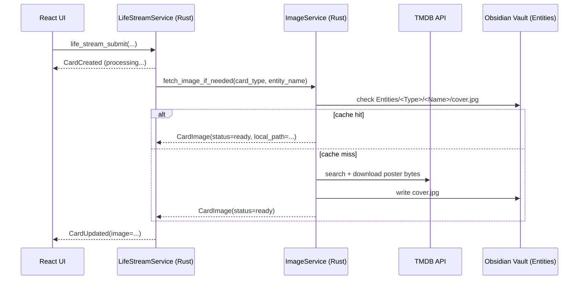

# Life OS Architecture

This documentation maps the **Life OS ecosystem** across 4 projects:

- **CodexMonitor-lifeos** — Tauri + React + Rust desktop app (Life Stream UI + Codex UI)
- **life-mcp** — Node.js MCP server (tools + advisors + data persistence)
- **Obsidian Vault** — primary datastore (stream logs + entity files + indexes)
- **life-os** — system root (domain YAML configs + command runner + docs)

**Last updated:** 2026-02-02
**Root:** `/Volumes/YouTube 4TB/`

## Project roots

| Project | Path |
| --- | --- |
| CodexMonitor-lifeos | `/Volumes/YouTube 4TB/CodexMonitor-lifeos` |
| life-mcp | `/Volumes/YouTube 4TB/code/_archive/life-mcp` |
| Obsidian Vault | `/Volumes/YouTube 4TB/Obsidian` |
| life-os | `/Volumes/YouTube 4TB/code/life-os` |

---

## Bird’s-eye system diagram

```mermaid
flowchart LR
  %% --- Desktop app ---
  subgraph CM["CodexMonitor-lifeos (Tauri desktop)"]
    UI["React UI\nLife Stream + (optional) Codex chat"] -->|invoke(...)| TC["Tauri commands\n(generate_handler![])"]
    TC --> RB["Rust backend\nAppState + services"]
    RB --> AS["Codex app-server\nJSON-RPC over stdio"]
    RB --> MCPB["MCP bridge\nLifeMcpBridge\nJSON-RPC over stdio"]
    RB --> VAULT["Obsidian Vault\nStream/*.md\nEntities/*\nIndexes/*\nRuntime/*"]
  end

  %% --- MCP server ---
  MCPB --> MCP["life-mcp (Node.js MCP server)\n@modelcontextprotocol/sdk"]
  MCP --> SUPA["Supabase (optional)\nlife tables + stats"]
  MCP --> VAULT

  %% --- Config root ---
  MCP --> LIFEOS["life-os\nsystems/*.yaml\njustfile"]
  LIFEOS --> MCP

  %% --- Media images ---
  RB --> TMDB["TMDB API\n(multi search + poster fetch)"]
  TMDB -->|image bytes| RB
  RB -->|cache cover.jpg| VAULT
  VAULT --> UI
```

### ASCII (quick mental model)

```
[React UI] -> invoke() -> [Tauri Commands] -> [Rust]
                                     |-> [Codex app-server] (LLM decisions + chat turns)
                                     |-> [LifeMcpBridge] -> [life-mcp tools] -> [Obsidian + Supabase]
                                     |-> [ImageService] -> [TMDB] -> cache -> UI
```

---

## Two “modes”: Life OS mode vs normal Codex mode

This codebase supports **workspaces** with a `purpose`:

- `coding` (classic CodexMonitor chat-first workflow)
- `life` (Life Stream workflow + Obsidian-backed persistence)

In **this snapshot**, `src/App.tsx` sets `lifeOsMode = true`, which forces Life OS behavior by default:
- a Life workspace is auto-created if missing
- the main message surface becomes **LifeStreamView**
- the composer becomes **LifeStreamComposer**
- the right-side “monitor panel” is removed/hidden

**Normal Codex mode** still exists in code paths and Tauri commands (threads/turns), and Life Stream internally still uses the **Codex app-server** to produce decisions.

---

## Core data flows

### 1) Life Stream card flow (primary)

**User intent**: “log lunch”, “add delivery”, “I watched X”, “spent $Y”, etc.

1. **UI** (`LifeStreamComposer`) submits a card via `invoke("life_stream_submit", {...})`
2. **Rust** (`life_stream/mod.rs`) routes to `LifeStreamService::submit_card(...)`
3. **Service** (`life_stream/service.rs`)
   - creates a `StreamCard` (state = `pending`)
   - ensures a **day-thread** exists (one Codex thread per date per workspace)
   - builds a **decision prompt** (`build_lifestream_decision_prompt`)
4. **Codex app-server**
   - called via `WorkspaceSession.send_request("turn/start", ...)`
   - returns streamed deltas (`item/agentMessage/delta`) until `turn/completed`
5. **Decision parsing**
   - Rust extracts a JSON decision envelope from the Codex response
   - decision may include: `title`, `emoji`, `stats`, `entities`, `tool`, `tool_args`, `clarifications`
6. **MCP tool call (optional but common)**
   - Rust checks tool whitelist (`life_stream/mcp_registry.rs`)
   - calls `LifeMcpBridge.call_tool(tool, args)` → `tools/call`
7. **Enrichment**
   - Rust parses tool output (text + embedded JSON)
   - computes stats/entities and patches the card
8. **Persistence**
   - append card to Obsidian stream file (monthly file; “## Day” sections)
   - optionally update/create entity files under `Entities/...`
9. **Images (async)**
   - for media cards: fetch poster from TMDB, cache as `Entities/Media/<Name>/cover.jpg`
   - emit card patch with `image` to update UI

**Where this lives:**
- UI: `src/features/life-stream/**`
- Tauri entrypoints: `src-tauri/src/life_stream/mod.rs`
- Decision engine: `src-tauri/src/life_stream/service.rs`
- Obsidian write: `src-tauri/src/life_stream/obsidian.rs`
- Image cache + fetch: `src-tauri/src/life_stream/images/**`

### 2) MCP tool flow (Rust ↔ Node)

1. Rust spawns `node <life-mcp>/index.js` with:
   - `MCP_MODE=stdio`
   - `LIFE_OS_PATH=<obsidian_root>` (critical)
2. Rust performs MCP handshake:
   - `initialize` request
   - `initialized` notification
3. Tool invocation:
   - request: `tools/call` with `{ name, arguments }`
4. Response:
   - `{ content: [...] }` where `content` items are typically `type: "text"` and may embed JSON

**Where this lives:**
- Rust bridge: `src-tauri/src/life_stream/mcp_bridge.rs`
- Node server setup: `life-mcp/src/server/mcp.js`
- Registry + keyword search: `life-mcp/src/tool-registry.js`

### 3) Image pipeline (TMDB → cache → UI)



---

## Key integration contracts

### “Card patch” is the primary UI update mechanism
Rust emits `life_stream_event` updates with a `StreamCardPatch` + `newVersion`.  
Front-end applies patches only when `newVersion > currentVersion` to avoid stale updates.

### Tool outputs are parsed in two channels
The Life Stream parser tries to extract:
- **human-readable text** (for the card “analysis”)
- **structured JSON** (for stats/entities/images/enrichment)

Because tools can return JSON in multiple formats, the parser supports:
- `content: [{ type: "json", json: {...} }]`
- `content: [{ type: "text", text: "...{json}..." }]`
- `{ result: {...} }` and other nested wrappers (legacy / interoperability)

---

## Related docs

- [FILE_INDEX.md](FILE_INDEX.md)
- [API_REFERENCE.md](API_REFERENCE.md)
- [DATA_MODELS.md](DATA_MODELS.md)
- [STATE_MANAGEMENT.md](STATE_MANAGEMENT.md)
- [MCP_INTEGRATION.md](MCP_INTEGRATION.md)
- [LIFE_STREAM.md](LIFE_STREAM.md)
- [GOTCHAS.md](GOTCHAS.md)
