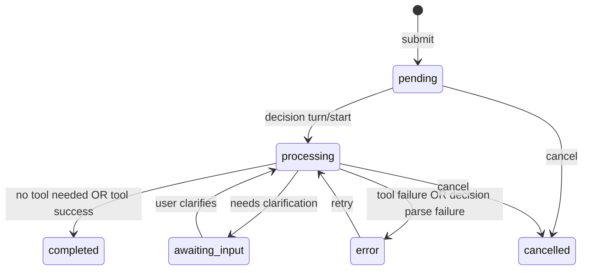

# Life Stream (Life OS feature)

**Snapshot analyzed:** `life-os-codebase-20260202`

Life Stream is the Life OS “timeline” UI:
- you type natural language
- the system decides what domain it belongs to
- optional MCP tool calls enrich the entry
- the card is persisted into Obsidian (and optionally Supabase)
- the UI updates via patch events

---

## Card lifecycle



### States (TS + Rust)
- `pending`
- `processing`
- `awaiting_input`
- `complete`
- `error`
- `cancelled`

**Source files**
- TS: `src/features/life-stream/types.ts`
- Rust: `src-tauri/src/life_stream/types.rs`

---

## Card types & domains

### CardType

`meal | delivery | media | youtube | expense | workout | note | misc`

### Domains (UI highlight rules)
**File:** `src/features/life-stream/utils/cardHighlights.ts`

Domains drive:
- highlight chip labels (“$35.20”, “520 cal”, “27 min”, etc)
- dashboard routing
- icon / emoji conventions

---

## Decision prompt structure (Rust)

**File:** `src-tauri/src/life_stream/service.rs` (`build_lifestream_decision_prompt`)

Key characteristics:
- instructs Codex to return a JSON decision envelope
- encourages bulk tools when possible
- includes a tool list “you may call” (from Rust ToolRegistry prompt list)
- includes constraints about timestamps, merchants, etc

> The decision prompt is the contract between Life Stream and the Codex app-server.  
> Changes to tool lists or desired JSON structure should be made intentionally.

---

## Obsidian persistence format

**File:** `src-tauri/src/life_stream/obsidian.rs`

### Stream file path

Life Stream writes to:

```
<vault>/Stream/YYYY-MM.md
```

### Day section + row insertion

For a given date:
- ensures header: `## Tue Feb 02` (weekday + month + day)
- ensures a table exists (Plan/Actual/Delta)
- inserts a new row just before the `---` separator

Example entry row pattern:

```
| -- | 12:34 Ate sushi | + | <!--task:YYYY-MM-DD-HHMM-<card_id>--> 
```

### Note block metadata (HTML comments)

After the day section separator, Life Stream writes a note block:

- `<!--note:<task_id>-->`
- `<!--prompt_b64:<base64>-->` (optional)
- `<!--response_b64:<base64>-->` (optional)
- `<!--duration_ms:<n>-->` (optional)
- then human-readable body text

This enables:
- reload/parsing existing cards
- recovering original input + assistant response
- matching rows to cards even if titles change

**Gotcha:** editing these HTML comments manually can break parsing.

---

## Image handling

### When images are fetched
Image enrichment is primarily used for:
- **media** cards (TMDB posters)
- potentially other entities with known image sources

**Rust image service**
- `src-tauri/src/life_stream/images/service.rs`

### Cache locations
Images are cached under the vault, typically:

```
Entities/Media/<Title>/cover.jpg
Indexes/media_images.json
```

The UI reads the cached local path and displays it in cards.

---

## Highlight chips per domain

**File:** `src/features/life-stream/utils/cardHighlights.ts`

Examples:
- Nutrition: calories + macros
- Finance: amount + category
- Delivery: total + merchant
- Media: rating + year + runtime
- Exercise: duration + calories burned

This is driven entirely off `card.stats` keys.

---

## Tauri commands used by Life Stream

Life Stream interacts with the backend via these `invoke(...)` targets:
- `life_stream_load_day`
- `life_stream_submit`
- `life_stream_cancel`
- `life_stream_retry`
- `life_stream_clarify`
- `life_stream_set_obsidian_root`

Full command list: [API_REFERENCE.md](API_REFERENCE.md)

---

## Related docs

- [ARCHITECTURE.md](ARCHITECTURE.md)
- [API_REFERENCE.md](API_REFERENCE.md)
- [DATA_MODELS.md](DATA_MODELS.md)
- [MCP_INTEGRATION.md](MCP_INTEGRATION.md)
- [STATE_MANAGEMENT.md](STATE_MANAGEMENT.md)
- [GOTCHAS.md](GOTCHAS.md)
